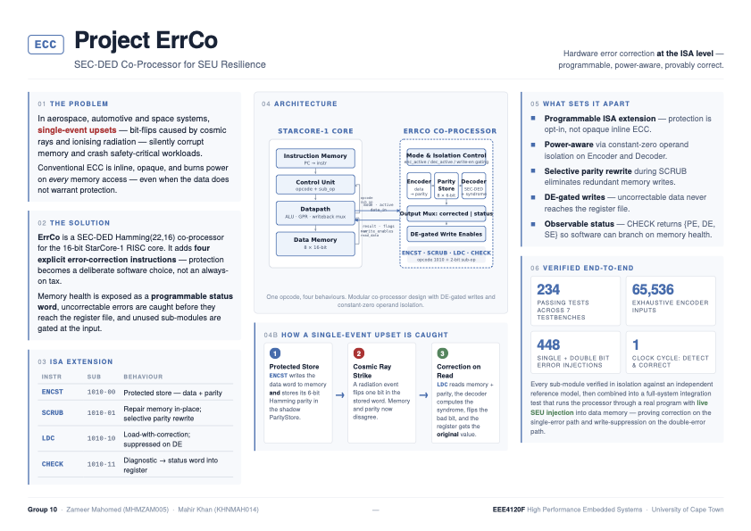

# Project ErrCo: Radiation-Hardened StarCore-1 Processor

## Overview
Project ErrCo introduces an error-correcting hardware co-processor integrated directly into the 16-bit single-cycle **StarCore-1** processor pipeline. By exploiting the unassigned `1010` opcode space, the **ErrCo Subsystem** delivers transparent, high-performance Single Error Correction and Double Error Detection (SEC-DED) using an Extended Hamming (22,16) block architecture. This design enables atomic fault repair within a single execution cycle without modifying the core baseline processing structures.

The development, synthesis verification, and systemic testing of this architecture are built upon **Icarus Verilog** for circuit simulation and **GTKWave** for digital signal validation.


---

## Architecture Specifications

- **Word Width:** 16 bits data payload + 6 bits systematic parity (22-bit total codeword width)
- **Registers:** 8 General Purpose Registers (R0–R7), featuring active write-enable interception
- **Memory Infrastructure:** Fully isolated, independent Harvard Address spaces
- **Instruction ROM:** 16 words × 16 bits (loaded from `test/test.prog`)
- **Data RAM Matrix:** 8 words × 16 bits (loaded from `test/test.data`) 
- **Parity Shadow RAM:** 8 words × 6 bits (Internal co-processor space tracking Data RAM indices)
- **Execution Lifecycle:** Strictly single-cycle combinational resolution; memories write synchronously on `posedge clk`, while error-syndrome evaluation, bit-flipping, and double-fault suppression settle combinationally within the single clock phase.

### Extended Instruction Set Architecture (ISA)

| Opcode (4-bit) | Mnemonic | Sub-Op (Bits [5:4]) | Type   | Description |
| -------------- | -------- | ------------------- | ------ | ----------- |
| `0000`         | LD       | —                   | I-type | Standard data load from data memory to register  |
| `0001`         | ST       | —                   | I-type | Standard unprotected register store to data memory  |
| `0010–1001`    | R-type   | —                   | R-type | Native compute operations (`ADD`, `SUB`, `AND`, etc.) |
| `1010`         | **ENCST**| `2'b00`             | ErrCo  | **Encoded Store:** Generate 6-bit parity and write to memory |
| `1010`         | **SCRUB**| `2'b01`             | ErrCo  | **Memory Scrub:** Read, verify, and overwrite corrected data/parity |
| `1010`         | **LDC** | `2'b10`             | ErrCo  | **Verified Load:** Load from data memory, correct single errors |
| `1010`         | **CHECK**| `2'b11`             | ErrCo  | **Diagnostic Check:** Output 16-bit status word `{13'b0, PE, DE, SE}`  |
| `1011`         | BEQ      | —                   | I-type | Branch if R[RS1] == R[RS2] |
| `1100`         | BNE      | —                   | I-type | Branch if R[RS1] != R[RS2] |
| `1101`         | JMP      | —                   | I-type | Unconditional jump |


---

## Folder Structure

```

Project-ErrCo/
├── Makefile                    # Simulation and test suite automation
├── src/
│   ├── Parameter.v            # Compile-time hardware constraints
│   ├── ALU.v                  # 16-bit execution arithmetic logic
│   ├── GPR.v                  # Register file (R0-R7) with manual R0-grounding
│   ├── InstructionMemory.v    # Program ROM array
│   ├── DataMemory.v           # Core Data RAM array
│   ├── ALU_Control.v          # ALU function controller
│   ├── ControlUnit.v          # Main CPU instruction decoder with ErrCo support
│   ├── Datapath.v             # Intercepted CPU datapath core
│   ├── StarCore1.v            # Top-level wrapper module
│   ├── Encoder.v              # Combinational Hamming matrix encoding logic
│   ├── Decoder.v              # Combinational syndrome calculation and correction
│   ├── ParityStore.v          # 8x6-bit shadow parity memory block
│   ├── ErrCo_Control.v        # Structural co-processor orchestration layer
│   └── ErrCo.v                # Mode-aware co-processor interface & operand isolation
├── tb/
│   ├── ErrCo_Control_tb.v     # Component testbench for core hardware primitives
│   ├── ErrCo_tb.v             # Unit testbench for mode-aware isolation logic
│   └── StarCore1_tb.v         # Full-system fault injection integration testbench
├── test/
│   ├── test.prog              # Target test instructions (15-instruction validation trace)
│   └── test.data              # Baseline memory data contents
├── build/                     # Compiled simulation executables (auto-created)
└── waves/                     # VCD output path for GTKWave inspections
```
---

## Co-Processor Implementation & Integration Architecture

### 1. Hardwired XOR Tree Encoding (`src/Encoder.v`)
Houses parallel combinational logic paths computing overlapping parity vectors on a 16-bit data word input to produce a 6-bit systematic verification token.

### 2. Parity Shadow RAM Array (`src/ParityStore.v`)
Implements an 8x6-bit register tracking structure mirroring the Data Memory access addresses. Writes are clocked synchronously on `posedge clk` through an internal write enable, while reads remain entirely combinational.

### 3. Error Syndrome Decoding & Bit Repair (`src/Decoder.v`)
Regenerates a 5-bit error syndrome vector ($S = s_{4}s_{3}s_{2}s_{1}s_{0}$) and global check bits to isolate memory anomalies on the fly. Single-bit data or parity faults are combinationally corrected through localized bitwise inversion, routing pristine data out on the `Error_Corr_Result` bus. Multi-bit faults flip the `DE_flag` output high.

### 4. Mode Abstraction & Operand Isolation (`src/ErrCo.v`)
Decodes instruction sub-operations while implementing an explicit low-power constant-zero operand isolation mask. When a core element is idle, its data buses are clamped to logical low to stop power dissipation across the downstream combinational logic arrays.

### 5. Datapath Interception & Failure-Isolation Gating (`src/Datapath.v`)
The integration interfaces with the baseline modules via external bus interception multiplexers:
- **RAM Write Port Override:** Captures the memory bus, allowing standard stores or co-processor repair data to write through based on `errco_mem_we`.
- **Register File Priority Override:** Expands the write-back mux path into a priority structure to select between the ALU, raw memory, or corrected data.
- **Double-Fault Write Suppression Gating:** If an uncorrectable multi-bit fault is identified by the decoder matrix, the co-processor clamps its write-enables to zero. This completely overrides the CPU control lines, locking the register files on the clock edge and protecting the core system from data corruption.

---

## Compilation and Simulation Terminal Controls


### Manual Execution Protocols

To compile and simulate the full hardware stack with fault injection profiles, run the StarCore1_tb.v file:

```bash
     iverilog -Wall -I ../src -o ../build/star_sim \
        ../src/Parameter.v ../src/ALU.v ../src/GPR.v \
        ../src/InstructionMemory.v ../src/DataMemory.v \
        ../src/ALU_Control.v ../src/ControlUnit.v \
        ../src/Encoder.v ../src/Decoder.v ../src/ParityStore.v \
        ../src/ErrCo_Control.v ../src/ErrCo.v \
        ../src/Datapath.v ../src/StarCore1.v \
        StarCore1_tb.v
     && cd ../test && ../build/star_sim
     && gtkwave ../waves/StarCore1_tb.vcd &
```
To run Encoder_tb.v:
This tb tests giving in a 16-bit data and generating the correct 6-bit parity. 
```bash
   iverilog -Wall -I ../src -o ../build/Encoder_sim ../src/Encoder.v Encoder_tb.v - need to be in tb
   cd ../test && ../build/Encoder_sim -- need to be in test
   gtkwave ../waves/Encoder_tb.vcd &
```

To run Decoder_tb.v:
This tb tests detecting and correcting SEUs and detecting DEDs for a given input parity and corresponding data
```bash
   iverilog -Wall -I ../src -o ../build/Decoder_sim ../src/Decoder.v Decoder_tb.v - need to be in tb
   cd ../test && ../build/Deccoder_sim -- need to be in test
   gtkwave ../waves/Decoder_tb.vcd &
```

To run ErrCo_Control_tb.v:
This tb runs the entire ErrCo as a standalone module, integrating Encoding, Decoding and the Pairty Store as one unit. 
```bash
     iverilog -Wall -I ../src -o ../build/ErrCo_Control_sim \
        ../src/Encoder.v ../src/Decoder.v ../src/ParityStore.v \
        ../src/ErrCo_Control.v ErrCo_Control_tb.v
     cd ../test && ../build/ErrCo_Control_sim
     gtkwave ../waves/ErrCo_Control_tb.vcd &
```

To run ErrCo_tb.v:
This tb runs the entire ErrCo as a standalone module, including the StarCore1 integration:
```bash
     iverilog -Wall -I ../src -o ../build/ErrCo_sim \
        ../src/Encoder.v ../src/Decoder.v ../src/ParityStore.v \
        ../src/ErrCo_Control.v ../src/ErrCo.v ErrCo_tb.v
     cd ../test && ../build/ErrCo_sim
     gtkwave ../waves/ErrCo_tb.vcd &
```
